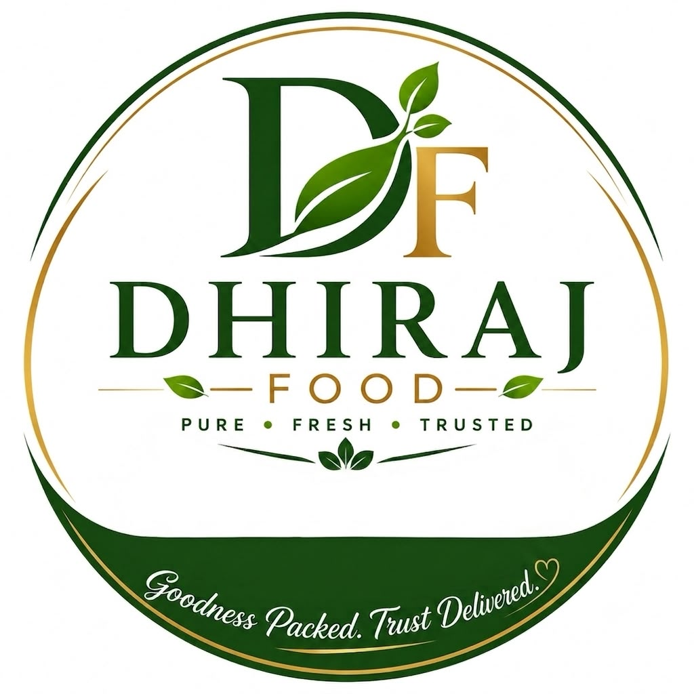

<div align="center">
  
  
  # Dhiraj Food
  
  **Authentic Taste. Premium Quality.**
  
  <br />

  
  
  
  

  <br />

  <p>
    Welcome to the official website repository of <strong>Dhiraj Food</strong>, a trusted importer and distributor of premium dry fruits, spices, pulses, and food products located in Birgunj, Nepal.
  </p>
  
  <p>
    <a href="https://dhirajfood.com/"><strong>View Live Website »</strong></a>
  </p>
</div>

<hr />

## 🌟 About The Project

This repository hosts the static, responsive landing page for **Dhiraj Food**, designed to showcase the brand's premium product lineup, company history, and contact details. It is built using pure HTML, CSS, and vanilla JavaScript with a modern, elegant, and user-friendly interface.

> **Trusted Since 2000** - We deliver quality, trust, and exceptional taste to households and businesses across Nepal.

## ✨ Key Features

- **📱 Fully Responsive**: Fluid, mobile-first design ensuring flawless layout on desktop, tablet, and mobile devices.
- **🎨 Modern Animations**: Engaging SVG wave backgrounds and an automated hero slider.
- **🛍️ Product Showcase**: A beautiful grid display showcasing 35+ premium products like Cashews, Almonds, Pistachios, and spices.
- **🏢 Brand Story**: An engaging 'About Us' section detailing the story behind Dhiraj Food, founded in 2000 by Shree Bhagwan Sah.
- **📍 Integrated Contact**: Live Google Maps embed, direct WhatsApp chat bubble, and easy-to-use social media links.

## 🛠️ Built With

The project uses a lightweight stack with no heavy dependencies:

* **HTML5**: Semantic, accessible markup.
* **CSS3**: Custom styles, variables, Grid & Flexbox layouts, and smooth transition effects.
* **JavaScript**: Vanilla JS for mobile menu toggling and automated hero slider functionality.
* **Google Fonts**: [Poppins](https://fonts.google.com/specimen/Poppins) & [Great Vibes](https://fonts.google.com/specimen/Great+Vibes) for modern typography.
* **Font Awesome**: Scalable vector icons for UI elements.

## 🚀 Getting Started

To run the project locally, you only need a web browser. No complex build tools or servers are required!

1. **Clone the repository:**
   ```bash
   git clone https://github.com/your-username/dhirajfood.com.git
   ```
2. **Navigate to the directory:**
   ```bash
   cd dhirajfood.com
   ```
3. **Open the project:**
   Simply double-click on `index.html` to open it in your default web browser, or serve it using a local live server extension (like VSCode Live Server).

## 📞 Contact Details

* 📍 **Address**: Adarshnagar, Birgunj, Nepal
* 📞 **Phone**: [+977 9804264443](tel:+9779804264443)
* 💬 **WhatsApp**: [Chat on WhatsApp](https://wa.me/9779804264443)
* ✉️ **Email**: [dhirajkumar13022@gmail.com](mailto:dhirajkumar13022@gmail.com)

## 🌐 Connect With Us

[](https://www.facebook.com/share/14hdJfsSK2d/?mibextid=wwXIfr)
[](https://www.instagram.com/dhirajfood_003/)
[](https://www.tiktok.com/@dhirajfood003?_r=1&_t=ZS-98HIXhVzoUW)

<br />

<div align="center">
  <i>Designed to perfection. &copy; 2026 Dhiraj Food.</i>
</div>
